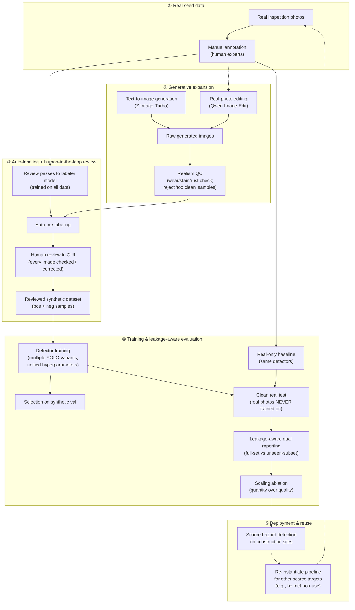

# Figure 1 — 管线总图（mermaid 草图，2026-09-14）

> 用途：先用 mermaid 把思路直观记下来；定稿前用 TikZ 正式重绘为 `figures/fig1_pipeline.pdf`，替换 `working_paper.tex` 中 Fig.1 占位。
> 红线：图只表达流程；具体数字不写进图（数字以 PROGRESS.md 三（结果与结论）为准）。

## 节点释义（写 Caption / Methodology 时用）

| 环节 | 实际做法 | 论文里的说法 |
|---|---|---|
| ① Real seed data | 93 张真实巡检照片人工标注（57 正 + 36 负） | small real seed set with expert annotation |
| ② Generative expansion | Z-Image-Turbo 文生图 + Qwen-Image-Edit 编辑真实照片（+canny ControlNet 试验）；垃圾/磨损/锈迹真实感红线 | diffusion-based synthesis with realism constraints |
| ③ Labeling loop | 打标模型预标注 → GUI 逐张人工复核（100% 复核率） | auto-labeling with human-in-the-loop verification |
| ④ Training & evaluation | 多检测器统一超参；93 张真实照片绝不参与训练与选型；双口径泄露感知报告 | leakage-aware protocol: clean real test, dual reporting |
| ⑤ Deployment & reuse | 工地危险目标检出；管线复用到下一稀缺目标（安全帽） | reusable augmentation recipe for scarce targets |

## Fig.1 英文 Caption 草稿（定稿时可改）

**Fig. 1.** Overview of the proposed pipeline. A small expert-annotated real seed set (①) drives a diffusion-based expansion stage (②) that synthesizes scarce hazardous-scenario images under realism constraints. Every generated image passes through an auto-labeling stage with human-in-the-loop verification (③) before entering training, yielding a reviewed synthetic dataset. Detectors are trained and evaluated under a leakage-aware protocol (④) in which real photos are never used for training, allowing the effect of generated-data quantity to be measured on clean real-world data. The recipe is designed to be re-instantiated for other scarce hazardous targets (⑤).

## TikZ 重绘提醒

- 建议布局：纵向四段（Seed → Generate → Review → Train/Eval），右侧竖排画 dashed 的 "reuse loop" 回到 Seed。
- 关键视觉对比：实线 = 主流程；虚线 = 可选/复用路径；把 "human review" 与 "clean real test" 两个质量门用同一种醒目标记（如盾牌/对勾底色框）。
- 图中不放具体数字（500/93 等），数字留给正文与表。
