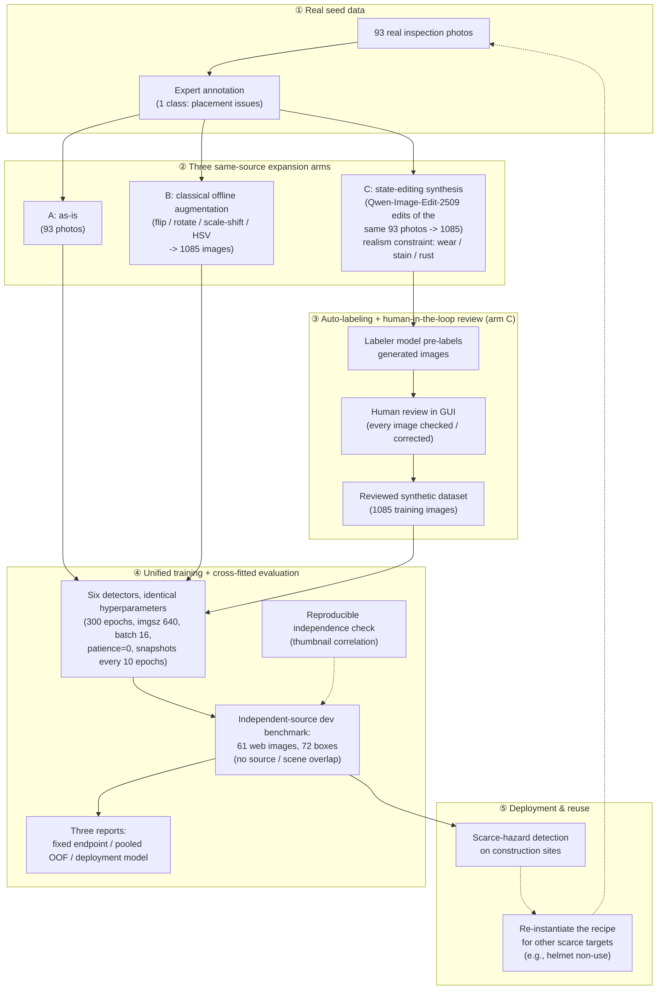

# Figure 1 — 管线总图（mermaid 草图，v4 口径）

> 用途：先用 mermaid 把思路直观记下来；定稿前用 TikZ 正式重绘为 `figures/fig1_pipeline.pdf`，替换 `working_paper.tex` 中 Fig.1 占位。
> 红线：图只表达流程；具体数字不写进图（数字以 `PROGRESS.md` 三（结果与结论）为准）。
> 当前口径：**dev61 = 61 张网络来源图**；统一训练后分三层报告 fixed endpoint、cross-fitted pooled OOF 和 deployment selection。

## 节点释义（写 Caption / Methodology 时用）

| 环节 | 实际做法 | 论文里的说法 |
|---|---|---|
| ① Real seed data | 93 张真实巡检照片人工标注（57 有框/179 框 + 36 空标）；**同时是 A/B 臂训练集与 C 臂编辑源** | small expert-annotated real seed set |
| ② Three arms | A = 原样 93 张；B = 传统离线增广到 1085 张；C = Qwen-Image-Edit-2509 编辑合成 1085 张 | same-source augmentation arms: none / classical / state-editing |
| ③ Labeling loop | 打标模型预标注 → GUI 逐张人工复核（100% 复核率） | auto-labeling with human-in-the-loop verification |
| ④ Unified protocol | 六 detector 统一超参；dev61 做 fixed endpoint、5 折 pooled OOF 与部署选权；来源独立性由缩略图相关性检验支持 | unified training with cross-fitted held-out evaluation |
| ⑤ Deployment & reuse | 工地危险目标检出；管线复用到下一稀缺目标（安全帽） | reusable augmentation recipe for scarce targets |

## Fig.1 英文 Caption 草稿（定稿时可改）

**Fig. 1.** Overview of the proposed pipeline. A small expert-annotated real seed set (①) is expanded along three same-source arms (②): no augmentation, classical offline augmentation, and state-editing synthesis under a realism constraint. Generated images pass through auto-labeling with human-in-the-loop verification (③). All arms share one training protocol and are evaluated on an independently sourced development benchmark using a fixed endpoint, cross-fitted held-out predictions pooled for AP, and a separately identified deployment model (④). The recipe is designed to be re-instantiated for other scarce hazardous targets (⑤).

## TikZ 重绘提醒

- 建议布局：纵向四段（Seed → Expand → Review → Train/Evaluate），右侧竖排画 dashed 的 "reuse loop" 回到 Seed。
- 关键视觉对比：实线 = 主流程；虚线 = 检查/可选/复用路径；把 "human review" 与 "independent-source dev + cross-fitting" 两个质量门用同一种醒目标记。
- ② 建议画成从同一批 93 张分出的三条并行支路（A/B/C 并排），这是论文的核心对照，一眼要能看出"同源、只差怎么扩"。
- 最终绘图时可减少具体数字，把精确样本量留给正文与表。
