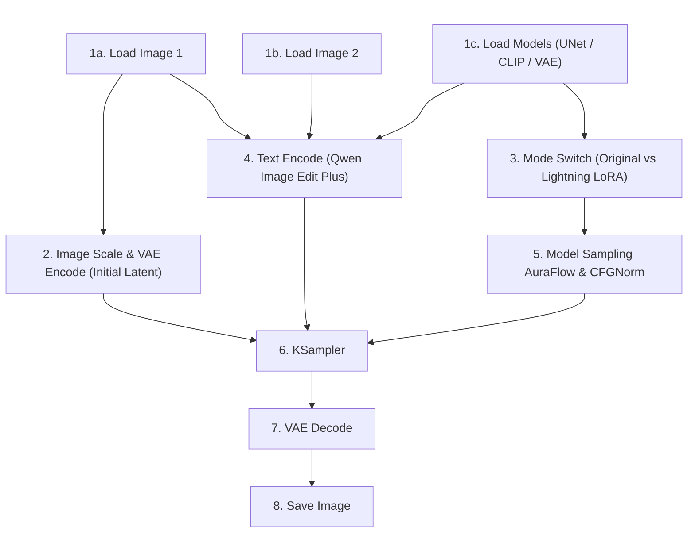

```mermaid
flowchart TD
    %% Top Input Layer
    subgraph S1 [" "]
        A1["1a. Load Image 1"]
        A2["1b. Load Image 2"]
        C["1c. Load Models (UNet / CLIP / VAE)"]
    end

    %% Image 1 Scaling & Latent Encode / Mode Switch
    A1 --> B["2. Image Scale & VAE Encode (Initial Latent)"]
    C --> D["3. Mode Switch (Original vs Lightning LoRA)"]

    %% Text Encode Plus
    A1 --> E["4. Text Encode (Qwen Image Edit Plus)"]
    A2 --> E
    C --> E

    %% Model Conditioning
    D --> F["5. Model Sampling AuraFlow & CFGNorm"]

    %% Core Sampling
    B --> G["6. KSampler"]
    E --> G
    F --> G

    %% Decode & Save
    G --> H["7. VAE Decode"]
    H --> I["8. Save Image"]

    %% Style
    style S1 fill:transparent,stroke:transparent
```