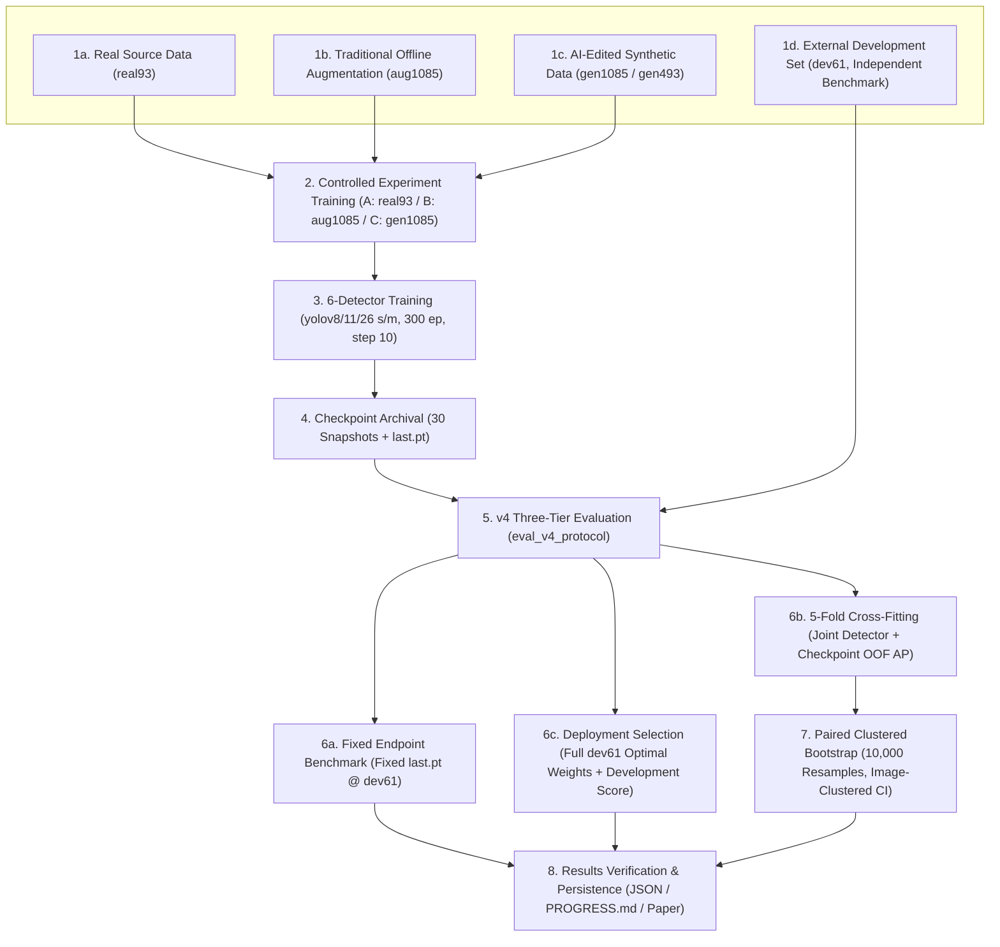

```mermaid
flowchart TD
    %% 1. Data Preparation & Partitioning
    subgraph S1 [" "]
        A1["1a. Real Source Data (real93)"]
        A2["1b. Traditional Offline Augmentation (aug1085)"]
        A3["1c. AI-Edited Synthetic Data (gen1085 / gen493)"]
        A4["1d. External Development Set (dev61, Independent Benchmark)"]
    end

    %% 2. Experimental Arm Training
    A1 --> B["2. Controlled Experiment Training (A: real93 / B: aug1085 / C: gen1085)"]
    A2 --> B
    A3 --> B

    %% 3. Detector Multi-Model Array Training
    B --> C["3. 6-Detector Training (yolov8/11/26 s/m, 300 ep, step 10)"]

    %% 4. Artifact & Snapshot Archival
    C --> D["4. Checkpoint Archival (30 Snapshots + last.pt)"]

    %% 5. Three-Tier Evaluation Protocol
    D --> E["5. v4 Three-Tier Evaluation (eval_v4_protocol)"]
    A4 --> E

    %% 6. Evaluation Breakdown
    E --> F1["6a. Fixed Endpoint Benchmark (Fixed last.pt @ dev61)"]
    E --> F2["6b. 5-Fold Cross-Fitting (Joint Detector + Checkpoint OOF AP)"]
    E --> F3["6c. Deployment Selection (Full dev61 Optimal Weights + Development Score)"]

    %% 7. Statistical Inference & Testing
    F2 --> G["7. Paired Clustered Bootstrap (10,000 Resamples, Image-Clustered CI)"]

    %% 8. Artifact Finalization & Persistence
    F1 --> H["8. Results Verification & Persistence (JSON / PROGRESS.md / Paper)"]
    F3 --> H
    G --> H

    %% Styles
```